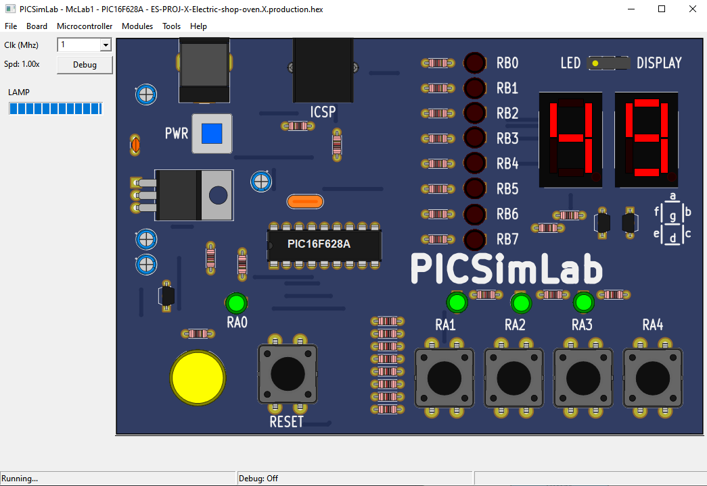
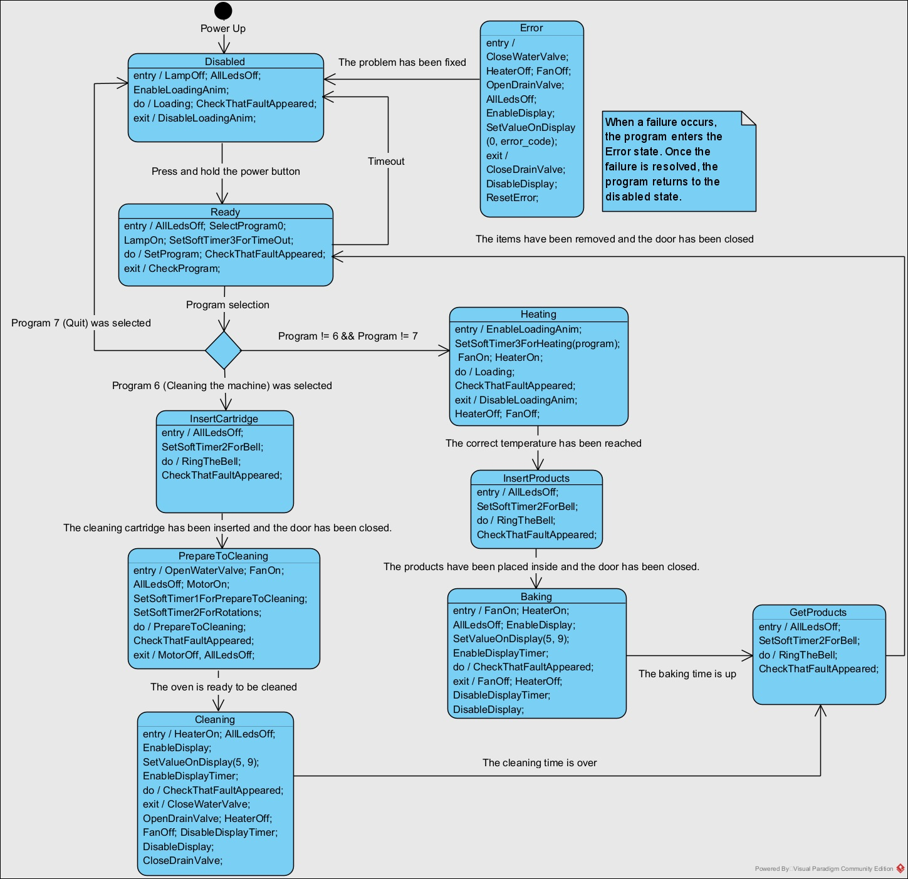
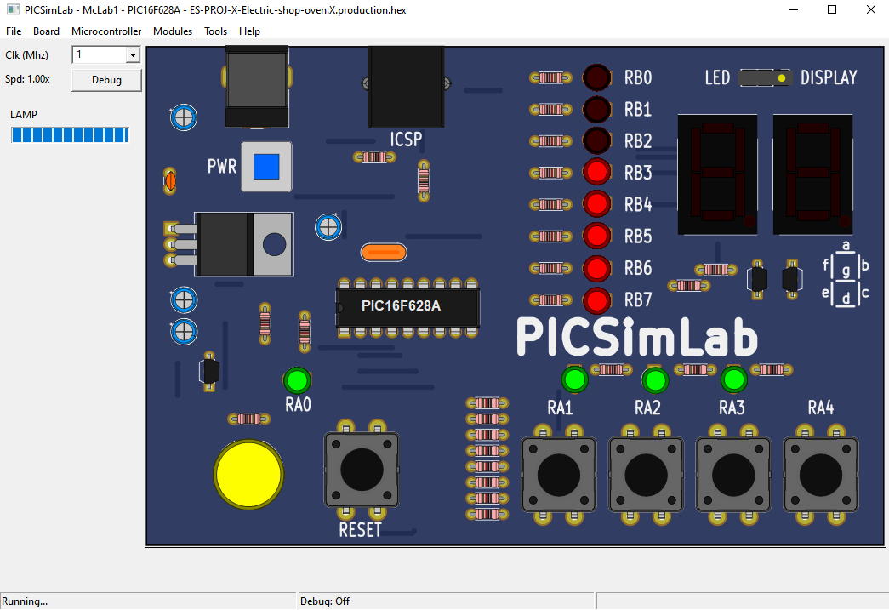

# Elektryczny Piec Sklepowy — Sterownik PIC16F628A / Electric Shop Oven Controller

Projekt semestralny — Systemy Wbudowane (Informatyka, sem. letni 2025/2026)<br>
Semester project — Embedded Systems course (Computer Science, spring 2025/2026)<br>

Implementacja uproszczonego sterownika elektrycznego pieca sklepowego oparta na mikrokontrolerze **PIC16F628A**, uruchamiana w emulatorze **PICSimLab**.<br>
A simplified controller for an electric shop oven, built for the **PIC16F628A** microcontroller and run in the **PICSimLab** emulator.<br>



---

## Opis projektu (PL)

Celem projektu jest implementacja uproszczonego sterownika elektrycznego pieca sklepowego z wykorzystaniem mikrokontrolera **PIC16F628A** oraz środowiska symulacyjnego **PICSimLab**. System pozwala na:

- wybór programu pieczenia,
- kontrolowanie temperatury i czasu pieczenia,
- obsługę sytuacji awaryjnych,
- obsługę debouncingu przycisków,
- automatyczne mycie pieca.

Sterownik napisano w języku **C** (MPLAB X IDE, kompilator **Microchip XC8**). Ze względu na ograniczenia sprzętowe mikrokontrolera (pamięć, stos) wykorzystano dyrektywę `#define` oraz słowo kluczowe `inline`, dzięki któremu kod funkcji jest wstawiany bezpośrednio w miejscu wywołania zamiast typowego mechanizmu wywoływania funkcji.

Logika sterownika oparta jest na **modelu maszyny stanowej** (zamiast programowania czysto strukturalnego), co znacznie ułatwia dalszą rozbudowę systemu. Każdy stan obsługuje trzy rodzaje akcji:

- `ACTION_ENTRY` — wykonywana jednorazowo przy wejściu do stanu,
- `ACTION_DO` — wykonywana cyklicznie w trakcie przebywania w stanie,
- `ACTION_EXIT` — wykonywana jednorazowo przy wyjściu ze stanu.

Sterowanie odbywa się za pomocą przycisków podłączonych do portu A, a sygnalizacja stanu maszyny — za pomocą lampy (RA0), diod LED (RB0–RB7) oraz wyświetlacza siedmiosegmentowego. Obsługa czasu i odświeżania wyświetlacza realizowana jest w przerwaniach od Timera 0 i Timera 1.

## Project description (EN)

The goal of this project is to implement a simplified controller for an electric shop oven using the **PIC16F628A** microcontroller and the **PICSimLab** simulator. The system supports:

- selecting a baking program,
- controlling temperature and baking time,
- handling fault/emergency situations,
- button debouncing,
- automatic oven cleaning.

The firmware is written in **C** (MPLAB X IDE, **Microchip XC8** compiler). Due to the microcontroller's hardware limits (memory, stack), the code relies on `#define` macros and the `inline` keyword, which inlines function bodies at the call site instead of using the standard function-call mechanism.

The controller logic is built around a **finite state machine** model (rather than plain structural programming), which makes the system much easier to extend. Each state handles three kinds of actions:

- `ACTION_ENTRY` — executed once when entering the state,
- `ACTION_DO` — executed repeatedly while in the state,
- `ACTION_EXIT` — executed once when leaving the state.

The oven is controlled with buttons wired to Port A, while its status is signaled via a lamp (RA0), LEDs (RB0–RB7), and a seven-segment display. Timing and display refresh are handled inside Timer 0 and Timer 1 interrupts.

---

## Konfiguracja sprzętowa / Hardware configuration

### Port A

| Pin | Typ / Type | Opis / Description |
|-----|------------|---------------------|
| RA0 | wyjście / output | Lampa sygnalizująca gotowość pieca / Ready-status lamp |
| RA1 | wejście / input | `PowerButton` (włączenie pieca) / `UpperButton` (wyższy program) |
| RA2 | wejście / input | `LowerButton` — niższy program / lower program |
| RA3 | wejście / input | `OkButton` — zatwierdzenie / confirm |
| RA4 | wejście / input | `FaultSimulationButton` — symulacja awarii / fault simulation |
| RA5–RA7 | — | nieużywane / unused |

### Port B

Port B pełni funkcję zbiorczą — steruje diodami LED oraz wyświetlaczem siedmiosegmentowym, w zależności od aktualnego stanu maszyny (wybór programu, poziom nagrzania, animacja przygotowania do czyszczenia, sygnał "dzwonka", pozostały czas lub kod błędu).
Port B is multi-purpose — it drives the LEDs and the seven-segment display depending on the current state (selected program, heating level, cleaning-prep animation, "bell" signal, remaining time, or error code).

| Pin | Wyjście steruje / Output drives | W stanie READY sygnalizuje / In READY signals |
|-----|----------------------------------|-------------------------------------------------|
| RB0 | — | Program 0 |
| RB1 | Silnik ramienia natryskowego / Spray-arm motor | Program 1 |
| RB2 | — | Program 2 |
| RB3 | — | Program 3 |
| RB4 | Zawór wody / Water valve | Program 4 |
| RB5 | Zawór odpływowy / Drain valve | Program 5 |
| RB6 | Wentylator / Fan | Program 6 |
| RB7 | Grzałka (przekaźnik) / Heater relay | Program 7 |

---

## Maszyna stanowa / State machine

System działa w 11 stanach / The system operates in 11 states:

`STATE_POWERUP` → `STATE_DISABLED` → `STATE_READY` → `STATE_HEATING` → `STATE_INSERT_PRODUCTS` → `STATE_BAKING` → `STATE_GET_PRODUCTS` → (powrót do `STATE_READY` / back to `STATE_READY`)

oraz ścieżka czyszczenia / plus the cleaning path:

`STATE_READY` → `STATE_INSERT_CARTRIDGE` → `STATE_PREPARE_TO_CLEANING` → `STATE_CLEANING` → `STATE_GET_PRODUCTS`

Z każdego stanu, w przypadku wykrycia awarii (`FaultSimulationButton`), następuje przejście do `STATE_ERROR`, a po jej usunięciu — powrót do `STATE_DISABLED`.
From any state, if a fault is detected (`FaultSimulationButton`), the machine transitions to `STATE_ERROR`; once resolved, it returns to `STATE_DISABLED`.

| Stan / State | Opis / Description |
|---|---|
| `STATE_POWERUP` | Tymczasowy stan startowy / Temporary start-up state, przechodzi od razu w `STATE_DISABLED` |
| `STATE_DISABLED` | Piec zablokowany / Oven locked. Przytrzymanie `PowerButton` odblokowuje piec |
| `STATE_READY` | Wybór programu pracy pieca / Select the oven program |
| `STATE_HEATING` | Nagrzewanie pieca / Oven heating up |
| `STATE_INSERT_CARTRIDGE` | Włożenie wkładu czyszczącego / Insert cleaning cartridge |
| `STATE_INSERT_PRODUCTS` | Włożenie produktów do wypieku / Insert products to bake |
| `STATE_BAKING` | Pieczenie / Baking in progress |
| `STATE_GET_PRODUCTS` | Odbiór gotowych produktów lub zużytego wkładu / Collect finished products or used cartridge |
| `STATE_PREPARE_TO_CLEANING` | Przygotowanie do czyszczenia pieca / Preparing to clean the oven |
| `STATE_CLEANING` | Mycie pieca / Cleaning the oven |
| `STATE_ERROR` | Stan awarii — wyświetlany kod błędu / Fault state — error code shown on display |

Diagram maszyny stanowej/State Machine Diagram


---

## Programy pracy pieca / Oven programs

Programy kodowane są metodą „1 z n” (one-hot), co pozwala przełączać je operacjami obrotu bitowego (`ROT_R1`, `ROT_L1`).
Programs are one-hot encoded, allowing selection via bitwise rotation (`ROT_R1`, `ROT_L1`).

| Program | Wartość / Value | Opis / Description |
|---|---|---|
| `PROGRAM_0_BUNS_FULL` | `0x01` | Bułki — cały piec / Buns — full oven |
| `PROGRAM_1_BUNS_HALF` | `0x02` | Bułki — pół pieca / Buns — half oven |
| `PROGRAM_2_COOKIES_FULL` | `0x04` | Ciastka — cały piec / Cookies — full oven |
| `PROGRAM_3_COOKIES_HALF` | `0x08` | Ciastka — pół pieca / Cookies — half oven |
| `PROGRAM_4_BREAD_2_TO_20` | `0x10` | Chleb, 2–20 szt. / Bread, 2–20 pcs |
| `PROGRAM_5_CASSEROLE_OR_SWEET_BUN` | `0x20` | Zapiekanka / drożdżówka / Casserole or sweet bun |
| `PROGRAM_6_CLEANING_THE_MACHINE` | `0x40` | Mycie pieca / Clean the oven |
| `PROGRAM_7_QUIT` | `0x80` | Wyjście / Quit |

---

## Kody błędów / Error codes

| Kod / Code | Stała / Constant | Stan, w którym wystąpił błąd / State the fault occurred in |
|---|---|---|
| 0 | `NO_ERROR` | Brak usterki / No fault |
| 1 | `ERROR_FOR_STATE_DISABLED` | `STATE_DISABLED` |
| 2 | `ERROR_FOR_STATE_READY` | `STATE_READY` |
| 3 | `ERROR_FOR_STATE_HEATING` | `STATE_HEATING` |
| 4 | `ERROR_FOR_STATE_INSERT_CARTRIDGE` | `STATE_INSERT_CARTRIDGE` |
| 5 | `ERROR_FOR_STATE_INSERT_PRODUCTS` | `STATE_INSERT_PRODUCTS` |
| 6 | `ERROR_FOR_STATE_BAKING` | `STATE_BAKING` |
| 7 | `ERROR_FOR_STATE_GET_PRODUCTS` | `STATE_GET_PRODUCTS` |
| 8 | `ERROR_FOR_STATE_PREPARE_TO_CLEANING` | `STATE_PREPARE_TO_CLEANING` |
| 9 | `ERROR_FOR_STATE_CLEANING` | `STATE_CLEANING` |

Kod błędu wyświetlany jest na wyświetlaczu siedmiosegmentowym. Powrót do pracy (po naprawie) następuje po wciśnięciu `OkButton` (RA3).
The error code is shown on the seven-segment display. Recovery happens by pressing `OkButton` (RA3) after the fault is fixed.

---

## Struktura projektu / Project structure

```
SourceCode/
└── ES-PROJ-X-Electric-shop-oven.X/     # Projekt MPLAB X / MPLAB X project
    ├── newmain.c                       # Główna pętla i funkcje stanów / Main loop & state functions
    ├── StatesAndActions.h              # Definicje stanów i akcji maszyny stanowej / State machine definitions
    ├── Buttons.h                       # Obsługa przycisków i debouncing / Button handling & debouncing
    ├── Programs.h                      # Definicje programów pieczenia / Baking program definitions
    ├── Timers.h                        # Softwarowe timery (soft_timer_1..3) / Software timers
    ├── Display.h                       # Sterowanie wyświetlaczem siedmiosegmentowym / Seven-segment display driver
    ├── DisplayTimer.h                  # Stoper wyświetlany na wyświetlaczu / Display countdown timer
    ├── Leds.h                          # Sterowanie diodami LED i lampą / LED & lamp control
    ├── Other.h                         # Animacje, silnik, zawory, grzałka, wentylator / Animations, motor, valves, heater, fan
    ├── Errors.h                        # Obsługa i kody błędów / Fault handling & error codes
    └── Microcontroller.h               # Inicjalizacja peryferiów i ISR / Peripheral init & interrupt handler
```

> Ścieżka względna projektu MPLAB X w repozytorium / Relative path to the MPLAB X project in this repo:
> `SourceCode/ES-PROJ-X-Electric-shop-oven.X`

---

## Demo

<table>
<tr>
<th>Animacja ładowania / Loading animation</th>
<th>Pieczenie z odliczaniem / Baking with countdown</th>
</tr>
<tr>
<td width="50%"></td>
<td width="50%"></td>
</tr>
<tr>
<td>Diody LED (RB0–RB7) zapalają się kolejno, sygnalizując postęp nagrzewania pieca. / LEDs (RB0–RB7) light up one by one, signaling the oven's heating progress.</td>
<td>Po osiągnięciu temperatury i włożeniu produktów, wyświetlacz siedmiosegmentowy pokazuje pozostały czas pieczenia. / Once the target temperature is reached and products are inserted, the seven-segment display shows the remaining baking time.</td>
</tr>
</table>

---

## Wymagania / Requirements

- [MPLAB X IDE](https://www.microchip.com/en-us/tools-resources/develop/mplab-x-ide)
- Kompilator [Microchip XC8](https://www.microchip.com/en-us/tools-resources/develop/mplab-xc-compilers/xc8)
- Emulator [PICSimLab](https://sourceforge.net/projects/picsim/files/v0.9.2/PICSimLab_0.9.2_241005_win64_setup.exe/download)
- Mikrokontroler docelowy / Target microcontroller: **PIC16F628A**

## Uruchomienie / Getting started

1. Sklonuj repozytorium / Clone the repository:
   ```bash
   git clone https://github.com/A-t-l-as/Embedded_Systems_Project-Electric_shop_oven
   ```
2. Otwórz projekt `SourceCode/ES-PROJ-X-Electric-shop-oven.X` w MPLAB X IDE.<br>
   Open the project `SourceCode/ES-PROJ-X-Electric-shop-oven.X` in MPLAB X IDE.<br>
3. Zbuduj projekt kompilatorem XC8 (Build).<br><br>
   Build the project using the XC8 compiler.<br>
4. Uruchom wynikowy plik `.hex` w PICSimLab, korzystając z konfiguracji płytki McLab1 - PIC16F628A.<br>
   Load the resulting `.hex` file into PICSimLab, using the board configuration McLab1 - PIC16F628A.<br>
5. Przytrzymaj `PowerButton` (RA1), aby uruchomić piec.<br>
   Hold `PowerButton` (RA1) to power on the oven.<br>
6. Aby zmienić program na wyższy lub niższy - należy użyć RA1 lub RA2.<br>
   To change the program to a higher or lower setting, use RA1 or RA2.<br>
7. Aby zaakceptować wybór należy wcisnąć RA3.<br>
   To accept your selection, press RA3.<br>
8. Aby potwierdzić wprowadzenie produktów do pieca - należy wcisnąć RA3.<br>
   To confirm that products have been loaded into the oven, press RA3.<br>
9. Aby potwierdzić wyjęcie produktów - należy wcisnąć RA3.<br>
   To confirm that products have been removed, press RA3.<br>
10. W celu zasymulowania awarii należy wcisnąć RA4, natomiast aby zakończyć awarię należy wprowadzić RA3.<br>
    To simulate a malfunction, press RA4; to end the malfunction, press RA3.<br>

---

## Autor / Author

**Atlas**

Projekt zrealizowany w ramach przedmiotu *Systemy wbudowane*, kierunek Informatyka, rok akademicki 2025/2026.
Project developed for the *Embedded Systems* course, Computer Science, academic year 2025/2026.